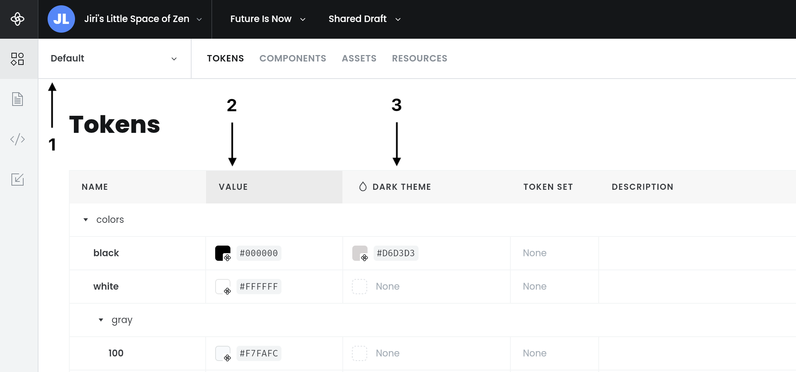
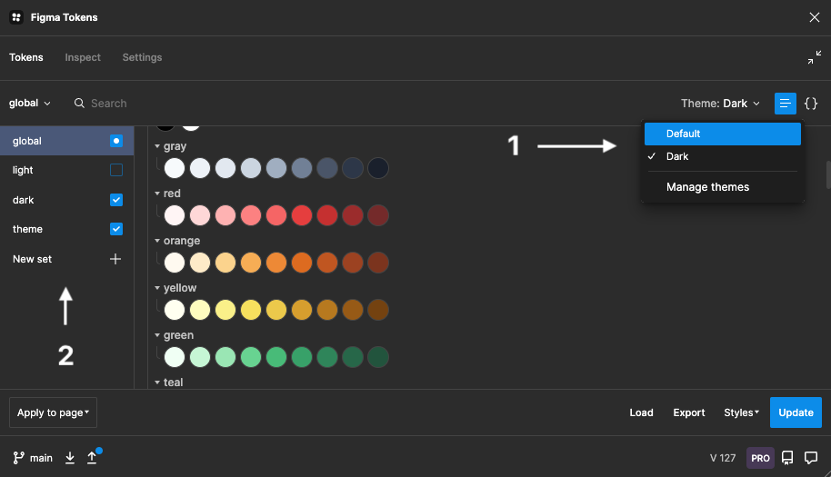

# Configuring mapping between Supernova and Figma Tokens

The most important part of the entire integration is the mapping between Supernova and Figma Tokens data. Because your token structures within Figma Tokens and also your Supernova setup can be very complex, you must clearly describe your intention as to how to map the data from one place to another. 

You must do so by providing configuration JSON file called `supernova.settings.json` with all the mapping inside. Here is an example how your settings file can look like:

```json
{
  "mode": "single-file",
  "mapping": [
    {
      "tokensTheme": "Brand A - Light",
      "supernovaBrand": "Default",
      "supernovaTheme": null
    },
    {
      "tokensTheme": "Brand A - Dark",
      "supernovaBrand": "Default",
      "supernovaTheme": "Dark theme"
    }
  ],
  "settings": {
    "dryRun": false,
    "verbose": false,
    "preciseCopy": false
  }
}
```

Following attributes for the settings file are available and must be provided:

**`mode`**

Signifies synchronization mode. Use `single-file` for sync from single file, and `multi-file` for sync from a directory.

**`settings`**

Changes how the synchronization behaves. Following attributes are available:

- `dryRun` (optional, default: `false`) allows you to test your synchronization without actually writing to the workspace. We recommend enabling this option while you are configuring your setup.
- `verbose` (optional, default: `false`) allows you to get detail log of what is happening with your data, such as how many tokens were updated, deleted etc.
- `preciseCopy` (optional, default: `false`) allows you to synchronize tokens fully

**`mapping`**

The most important part of the settings file is mapping. Mapping is an `Array` of rules how to map data from Figma Tokens to Supernova. Take the following map:

```json
{
  "supernovaBrand": "Default",
  "supernovaTheme": "Dark theme",
  "tokensTheme": "Brand A - Light",
},
```

Mapping such as this can be summarized by saying: `Take all the tokens from Figma Tokens included in theme "Brand A - Light" and sync them with Supernova brand "default", under token theme "Dark theme"`. You can define as many of those combinations as you want in the settings file. The keys in settings correspond to the following data in Supernova:



(1) signifies Supernova brand you want to sync data with and corresponds to `supernovaBrand` and is required. Both brand name or brand ID are valid value options. 

(2) is the base value of tokens. In Supernova, each token must have a value and can optionally have unlimited number of themes that override that value. If you, for example, have both `light` and `dark` themes in your Figma Tokens definitions, then you would map `light` into the base value for tokens and `dark` into a `dark theme`. To map the base value of tokens, set `supernovaTheme` to `null`.

(3) is theme override for tokens. You don't have to provide values for all the tokens and only overrides with different values than base token will be synchronized. Fill `supernovaTheme` with the name of the Supernova theme you would like to write your tokens into.

Finally, you have to provide which data you want to synchronize with the set combination of `supernovaBrand`/`supernovaTheme`. Here, you have two options:



(1) if you are using themes, you can select a specific theme to use as data. You can select exactly one theme per mapping. Fill `tokensTheme` with the name or id of Figma Tokens theme you would liek to write to Supernova.

(2) if you are not using themes, you can select combination of sets to use as data. You can select as many sets as you want, similarly how you select them within the Figma Tokens plugin itself. Fill `tokenSets` with `Array` of names of sets you have defined within Figma Tokens plugin. You can use as many sets as you want per each mapping.

**`mapping examples`**

Here are few mapping examples with explanation what each one does:

```json
1. Take tokens from 'Brand A - Light' theme defined in FT plugin and write them to Supernova brand called 'Default' as base token values.
2. Take tokens from 'Brand A - Dark' theme defined in FT plugin and write them as overrides to theme called 'Dark'. 

{
  "mapping": [{
      "tokensTheme": "Brand A - Light",
      "supernovaBrand": "Default",
      "supernovaTheme": null
  }, {
      "tokensTheme": "Brand A - Dark",
      "supernovaBrand": "Default",
      "supernovaTheme": "Dark"
  }]
}
```

If you are not using themes, you can substitute them with combination of sets:

```json
1. Combine tokens from (global, light) sets defined in FT plugin and write them to Supernova brand called 'Default' as base token values.
2. Combine tokens from (global, dark) sets defined in FT plugin and write them as overrides to theme called 'Dark'. 

{
  "mapping": [{
      "tokenSets": [
        "global",
        "light"
      ],
      "supernovaBrand": "Default",
      "supernovaTheme": null
  }, {
      "tokenSets": [
        "global",
        "dark"
      ],
      "supernovaBrand": "Default",
      "supernovaTheme": "Dark"
  }]
}
```

Finally, you can configure much more sophisticated combinations, for example to synchronize multiple brand and multiple themes together:

```json
1. Take tokens from 'Brand A - Light' theme defined in FT plugin and write them to Supernova brand called 'Main Brand' as base token values.
2. Take tokens from 'Brand A - Dark' theme defined in FT plugin and write them as overrides to Supernova brand called 'Main Brand', to theme called 'Dark'. 
3. Take tokens from 'Brand B - Light' theme defined in FT plugin and write them to Supernova brand called 'Alternate Brand' as base token values.
4. Take tokens from 'Brand B - Dark' theme defined in FT plugin and write them as overrides to Supernova brand called 'Alternate Brand', to theme called 'Dark'. 

{
  "mapping": [{
      "tokensTheme": "Brand A - Light",
      "supernovaBrand": "Main Brand",
      "supernovaTheme": null
  }, {
      "tokensTheme": "Brand A - Dark",
      "supernovaBrand": "Main Brand",
      "supernovaTheme": "Dark"
  }, {
      "tokensTheme": "Brand B - Light",
      "supernovaBrand": "Alternate Brand",
      "supernovaTheme": null
  }, {
      "tokensTheme": "Brand B - Dark",
      "supernovaBrand": "Alternate Brand",
      "supernovaTheme": "Dark"
  }]
}
```

Keep in mind that both `Brand` and `Theme` must be defined in Supernova before you can write into it, otherwise the sync command will throw error stating that no such brand exists.

After you have configured your mapping, go ahead and [run the sync command](./figma-tokens-sync.md).