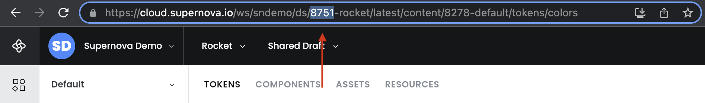

# List Workspaces

Using the Supernova CLI utility, you can get structure of all workspaces including all their design systems, brands and themes. This is very handy to get high-level overview of what all is available and currently setup under all of your workspaces when you are [configuring Figma Tokens plugin mapping](./figma-tokens-sync-mapping-examples.md).

## Listing all workspaces

Use the following command to list all workspaces, design systems, brands and themes that are available under provided API key:

```sh
  $ supernova describe-workspaces --apiKey="xxx-xxx-xxx"
```

This command requires API key to authenticate. You can obtain API key from your [Supernova profile](https://cloud.supernova.io/user-profile/general). We strongly recommend keeping your API key in secure storage, either through use of environment variables or key vault if you are using services like GitHub (actions). Never share your API key with anyone!

Once you've run the command, you'll obtain entire structure of your workspaces, similar to this:

```
---  Workspace "Dark Matter", handle: "dark-matter":

  ↳  DS "Dark Matter", id: 123:
    ↳  Brand: "Default", id: 59eecf09-3641-46e3-82cb-1d82a0a01bc8
      ↳ Theme: "Dark", id: d21a33e2-2105-493c-852e-a2c0a443a959
      ↳ Theme: "Grayscale", id: d21a33e2-2105-493c-852e-a2c0a443a900
```

You can use the data to help you with [configure Figma Tokens plugin mapping](./figma-tokens-sync-mapping-examples.md).

## Listing specific design system

In many cases, you only really need structure of a single design system. Use different command to focus the log only on a specific design system:

```sh
  $ supernova describe-design-system --apiKey="xxx-xxx-xxx" --designSystemId="8751" --dev
```

You can obtain design system ID by copying it from the URL on any page of Supernova Cloud. Make sure you have proper design system selected first before copying it:



Running this command will yield the structure of the selected design system, like this:

```
--- Design Systen "Dark Matter", id: 123:
  ↳  Brand: "Default", id: 59eecf09-3641-46e3-82cb-1d82a0a01b00
    ↳ Theme: "Dark theme", id: d21a33e2-2105-493c-852e-a2c0a443a900
```