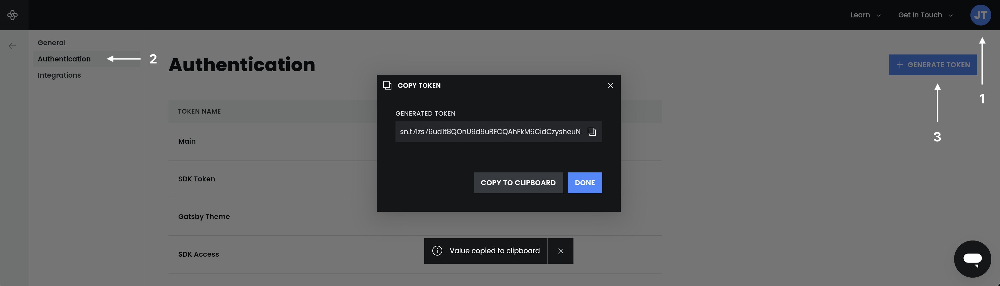
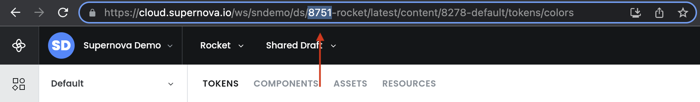

# Publish Documentation

Using the Supernova CLI utility, you can publish documentation directly from your command line. This is extremely useful if you want to update the published site when some remote data change. 
For example, if you commit a new markdown file to your repository, you can republish your documentation remotely by triggering the build using (GitHub/Azure/BB/GitLab) action.

## Usage

Use the following command to publish the documentation for a specific design system:

```sh
  $ supernova publish-documentation --apiKey="xxx-xxx-xxx" --designSystemid="1234"
```

Once run, there are two possible outcomes:

- If there is no ongoing build, a new build (publish) will be scheduled and your documentation will be published few seconds after that with the newly processed data.
- If there was an ongoing build, the command is silently ignored, to prevent overwhelming the build pipeline. There can only be one queued publish at the same time.

Because the publishing usually only takes a few seconds, it almost universally doesn't pose any issue. Do note however that the action is asynchronous, so you'll get response from the command about scheduling the build and you can continue with additional CI commands. There is currently no way to wait for the result of the build, but we are looking for your feedback if you would find that option useful.


### Obtaining API Key

Supernova CLI requires API key to authenticate. You can obtain API key from your [Supernova profile](https://cloud.supernova.io/user-profile/general). We strongly recommend keeping your API key in secure storage, either through use of environment variables or key vault if you are using services like GitHub (actions). Never share your API key with anyone!

Use your newly obtained key as the value of `--apiKey` attribute.



### Obtaining Design System ID

For this command to work, you also need to obtain ID of Supernova design system you want to publish. [Go to your design system](https://cloud.supernova.io/) and anywhere, in any section, obtain ID from the URL of your browser. Make sure you have selected the correct design system before copying the ID.

Use your newly obtained key as the value of `--designSystemId` attribute.

